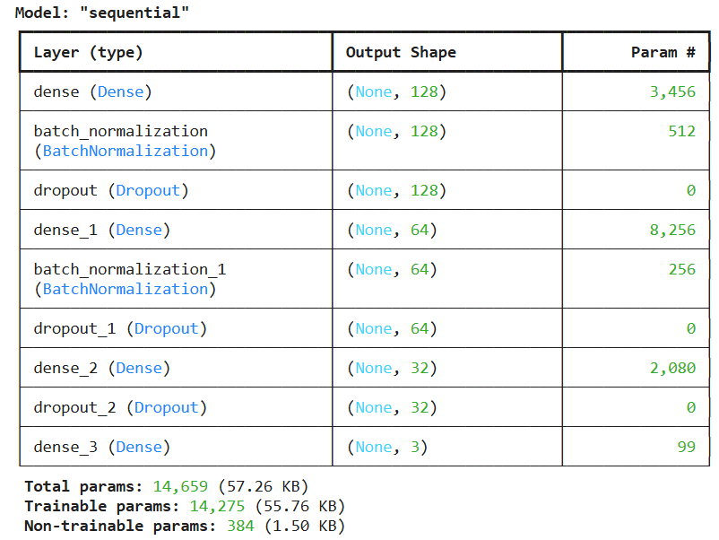
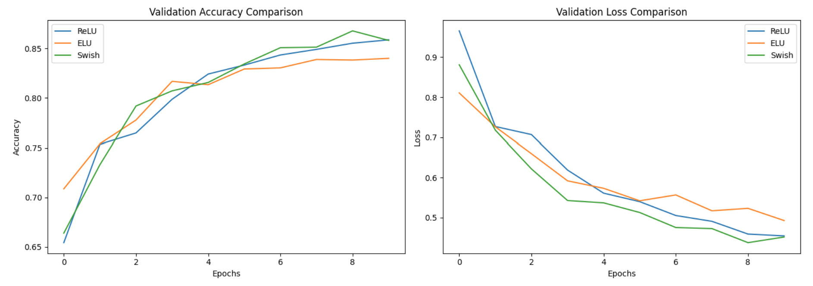
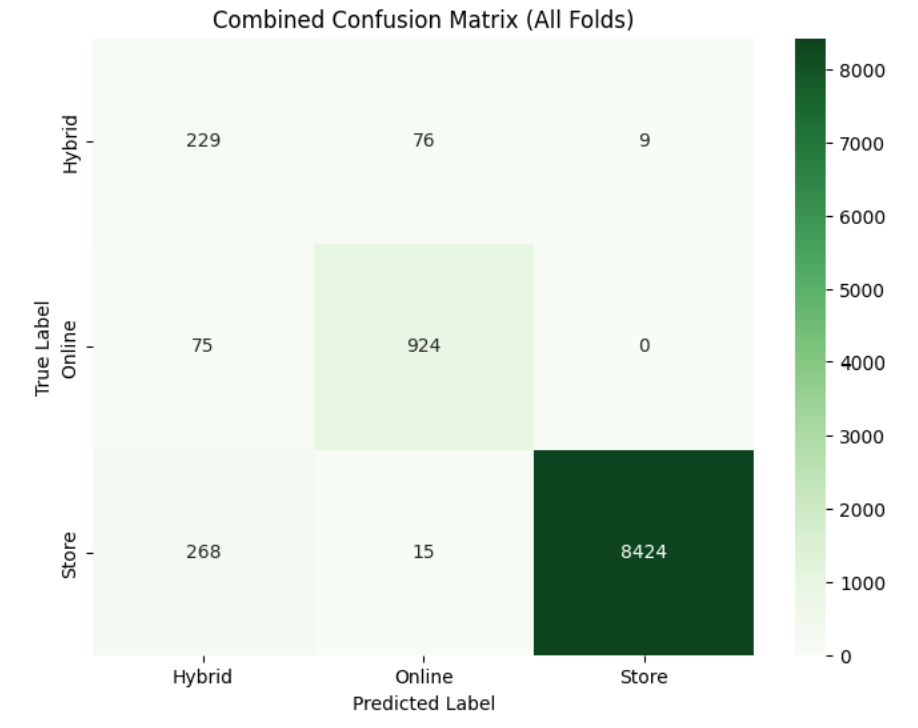

# 🛍️ Shopping Preference Classification with ANN

使用人工神经网络（ANN）对消费者的购物偏好（线上 / 线下 / 混合）进行多分类预测，并对比不同激活函数的性能表现。

---

## 📌 项目简介

本项目基于消费者购物行为数据集，构建并优化深度学习分类模型，预测用户倾向于**线上购物（Online）**、**线下门店（Store）** 还是**混合方式（Hybrid）**。

主要完成了以下三个任务：
- **Task 1**：数据预处理（缺失值填充、编码、划分数据集、标准化）
- **Task 2**：ANN 模型构建与训练（含类别权重、Early Stopping、学习率衰减）
- **Task 3**：激活函数对比实验（ReLU vs ELU vs Swish）

---

## 🗂️ 数据集

- **名称**：Online vs Store Shopping Dataset
- **目标变量**：`shopping_preference`（Hybrid=0, Online=1, Store=2）
- **特征**：性别、城市等级、年龄、消费金额等（含数值型与分类型特征）
- **数据集存在类别不平衡问题**，通过 `class_weight` 进行处理

---

## 🛠️ 使用工具

| 类别 | 工具 |
|------|------|
| 语言 | Python 3 |
| 深度学习框架 | TensorFlow / Keras |
| 数据处理 | pandas, NumPy, scikit-learn |
| 可视化 | Matplotlib, Seaborn |
| 运行环境 | Google Colab |

---

## 🧠 模型架构

```
Input Layer
  ↓
Dense(128, ReLU) → BatchNormalization → Dropout(0.30)
  ↓
Dense(64, ReLU)  → BatchNormalization → Dropout(0.25)
  ↓
Dense(32, ReLU)  → Dropout(0.20)
  ↓
Dense(3, Softmax)  ← 多分类输出
```

- **优化器**：Adam
- **损失函数**：Sparse Categorical Crossentropy
- **正则化**：L2 + Dropout + BatchNormalization
- **回调函数**：EarlyStopping（patience=10）、ReduceLROnPlateau（factor=0.5）



---

## ⚖️ 类别不平衡处理

由于三类样本分布极不均衡，采用自定义 `class_weight` 对少数类加权：

```python
class_weight = {
    0: 10.66,   # Hybrid（最少）
    1: 3.34,    # Online
    2: 0.38     # Store（最多）
}
```

---

## 🔬 激活函数对比实验

在相同架构下，分别使用 ReLU、ELU、Swish 训练模型，通过验证集准确率与损失曲线进行对比：

| 激活函数 | 特点 |
|----------|------|
| ReLU | 计算高效，但存在神经元死亡问题 |
| ELU | 负值区平滑，收敛更稳定 |
| Swish | 自门控机制，在深层网络中表现更佳 |



---

## 📊 评估指标

- Confusion Matrix
- Classification Report（Precision / Recall / F1）
- Macro F1-score（适用于类别不平衡场景）



---

## 🚀 如何运行

1. 在 Google Colab 中打开 `.ipynb` 文件
2. 上传数据集 `online vs store shopping dataset.csv`
3. 按顺序运行所有 Cell

```bash
# 本地运行（需安装依赖）
pip install tensorflow pandas numpy scikit-learn matplotlib seaborn
jupyter notebook
```

---

## 📁 文件结构

```
.
├── Introduction_to_deep_learning_part5.ipynb   # 主要代码
├── images/
│   ├── model_architecture.png                  # 模型结构图
│   ├── confusion_matrix.png                    # 混淆矩阵
│   └── activation_comparison.png               # 激活函数对比曲线
└── README.md
```

---

## 🔑 关键收获

- 掌握了处理**类别不平衡数据**的实用方法
- 理解了 BatchNormalization + Dropout 组合在防止过拟合中的作用
- 通过对比实验加深了对不同**激活函数**特性的理解
